# CapShop System Architecture Documentation

This is the PNG-rendered companion to `SystemArchitecture.md`. The original Mermaid-based document remains unchanged.

This document outlines the detailed system architecture, diagrams, and low-level designs for CapShop, a distributed e-commerce application based on microservices.

## 1. High-Level Design (HLD)
The system is built on a microservices architecture to ensure high scalability, independent deployments, and separation of concerns.

- **Frontend**: A React application (built with Vite) that communicates with the backend via the API Gateway.
- **Gateway**: A centralized entry point (acting as an API Gateway / Reverse Proxy) routing frontend HTTP requests to respective microservices.
- **Microservices**:
  - **AuthService**: Handles user authentication, authorization, registration, and JWT token issuance.
  - **CatalogService**: Manages the product catalog, categories, inventory, and search.
  - **OrderService**: Handles shopping cart management, order placement, and payment simulation.
  - **AdminService**: Admin portal logic, dashboards, and background processes watching across domains.
- **Message Broker**: **RabbitMQ** is used for asynchronous/event-driven communication (e.g., `OrderPlacedIntegrationEvent`).
- **Caching**: **Redis** is natively used for fast ephemeral storage (like user sessions or temporary carts/MFA tokens).
- **Database**: **MSSQL Server** serves as the persistent database for the microservices.

### HLD Context Diagram (Mermaid)
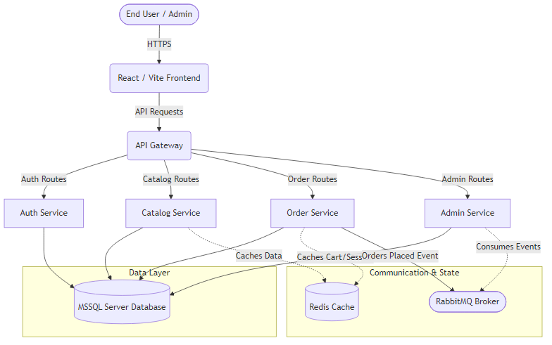

---

## 2. Component Diagram
This diagram shows the structural relationships between the various deployable units and the tech stack components.

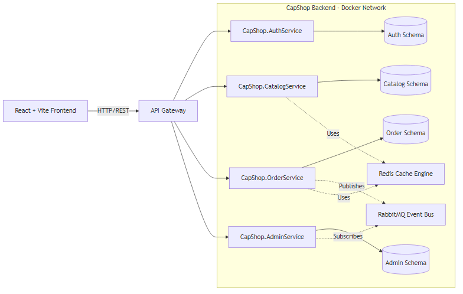

---

## 3. Deployment Diagram
Illustrating how the containers are hosted via Docker Compose.

---

## 4. State Machine Diagram (Order Lifecycle)
This state diagram models the dynamic behavior of the core `Order` entity throughout its payment and fulfillment lifecycle.

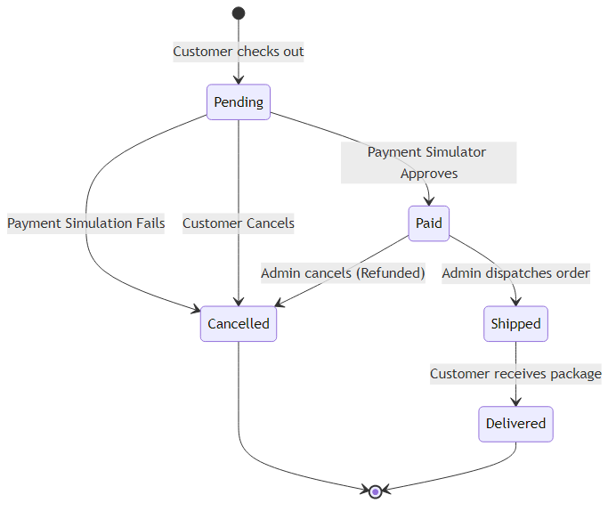

---

## 5. Activity Diagram (Checkout Flow)
This diagram maps out the branching logic required to determine whether an order can be successfully placed.

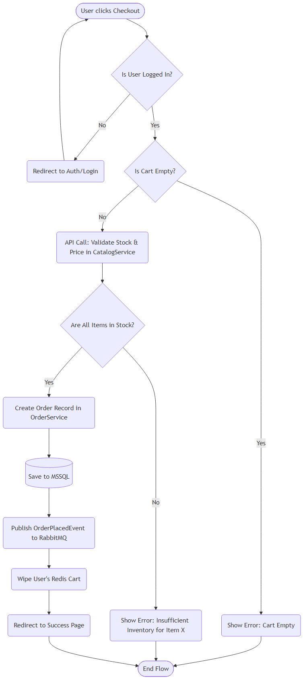

---

## 6. Use Case Diagram
The following diagram captures the interactions between the primary actors (Customer, Admin) and the CapShop system.

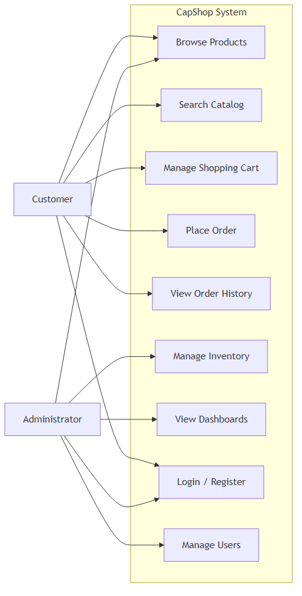

---

## 7. Entity-Relationship (ER) Diagram
The internal databases follow standard Relational constructs holding the E-Commerce domain.

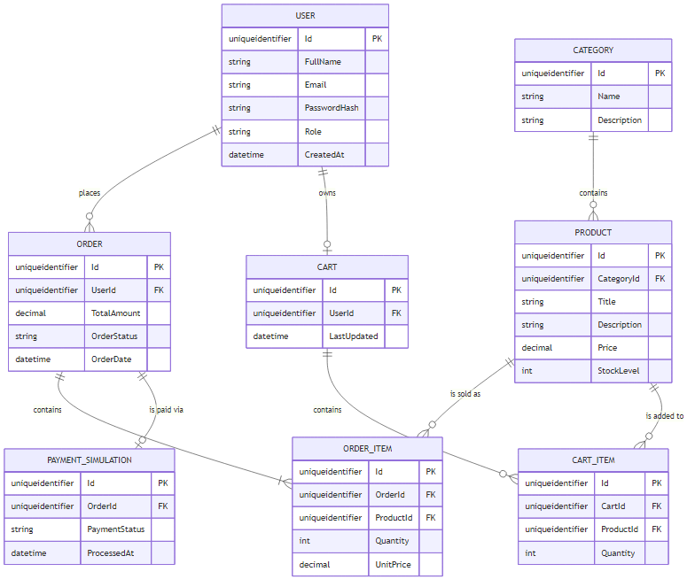

---

## 8. Data Flow Diagram (DFD)

### Level 0 (Context Diagram)
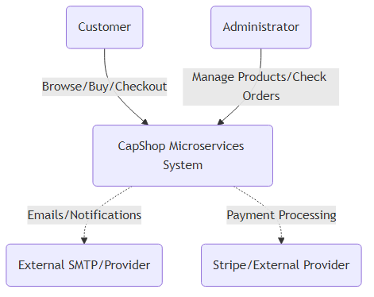

### Level 1 DFD
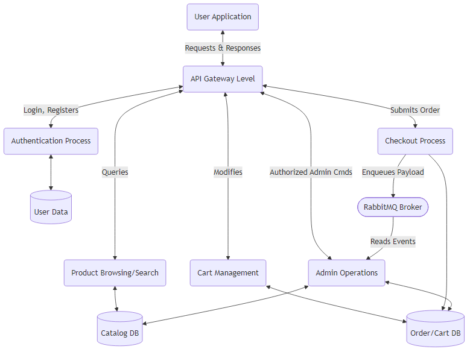

---

## 9. Class Diagram (Domain Model Example)
This class diagram focuses on the domain relationships used in the Order Service backing the transaction.

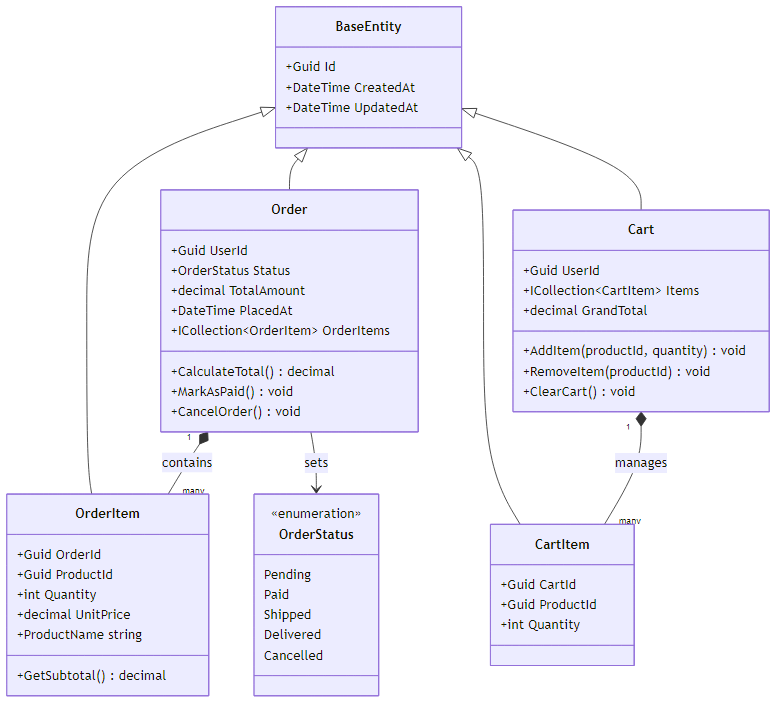

---

## 10. Sequence Diagrams

### 10.1 Authentication Loop
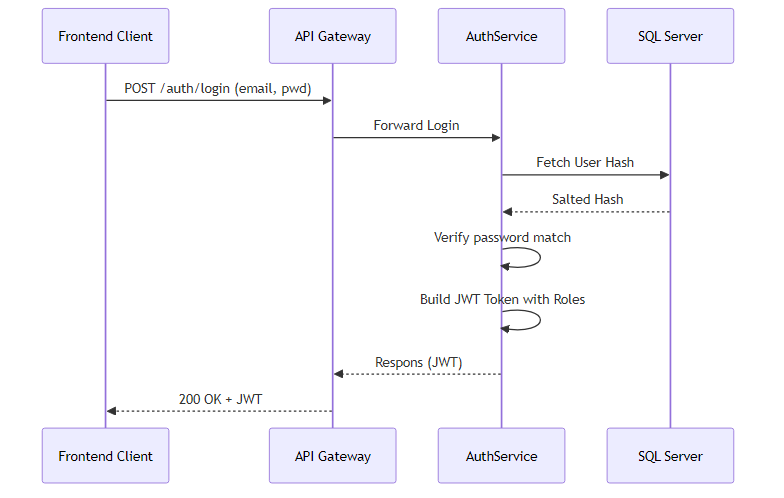

### 10.2 Order Placement Flow (Event Driven)
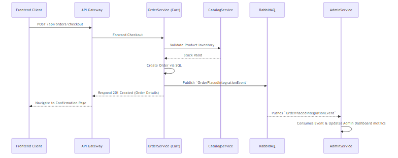

---

## 11. Detailed Service Diagrams

### 11.1 AuthService Detail
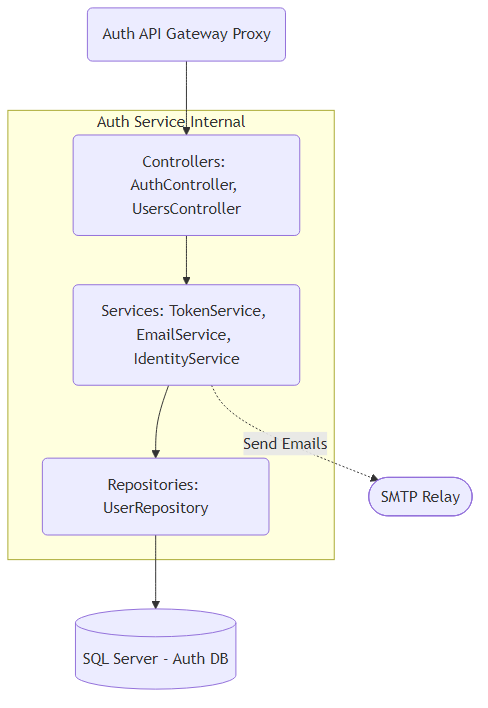

### 11.2 CatalogService Detail
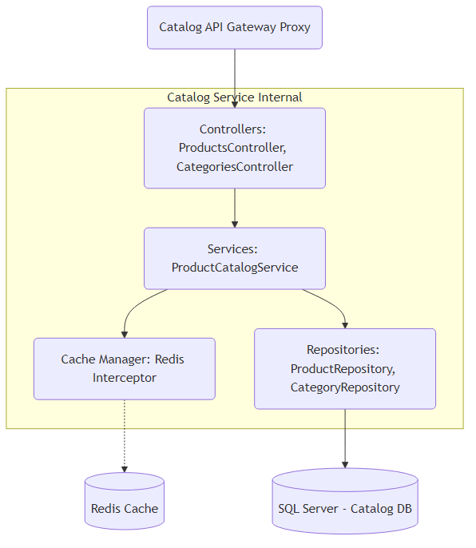

### 11.3 OrderService Detail
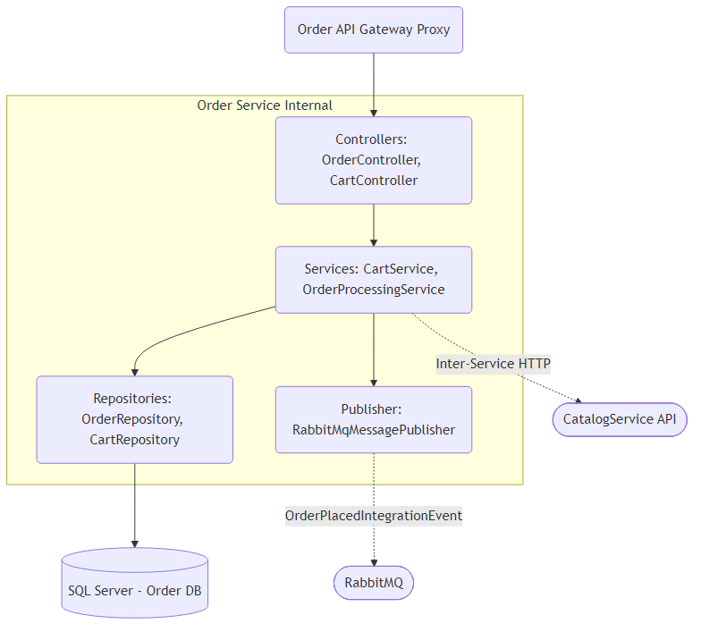

### 11.4 AdminService Detail
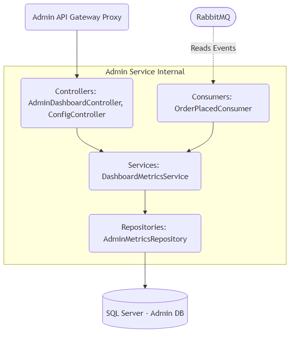

