# CapShop System Architecture Documentation

This document outlines the detailed system architecture, diagrams, and low-level designs for CapShop, a distributed e-commerce application based on microservices.

## 1. High-Level Design (HLD)

The system is built on a microservices architecture to ensure high scalability, independent deployments, and separation of concerns.

- **Frontend**: A React application (built with Vite) that communicates with the backend via the API Gateway.
- **Gateway**: A centralized entry point (acting as an API Gateway / Reverse Proxy) routing frontend HTTP requests to respective microservices.
- **Microservices**:
  - **AuthService**: Handles user authentication, authorization, registration, and JWT token issuance.
  - **CatalogService**: Manages the product catalog, categories, inventory, and search.
  - **OrderService**: Handles shopping cart management, order placement, and payment simulation.
  - **AdminService**: Admin portal logic, dashboards, and background processes watching across domains.
- **Message Broker**: **RabbitMQ** is used for asynchronous/event-driven communication (e.g., Saga Choreography for Checkout flow).
- **Caching**: **Redis** is natively used for fast ephemeral storage (Order Service shopping carts, Catalog distributed caching, and Auth Service MFA state tracking).
- **Database**: **MSSQL Server** serves as the persistent database for the microservices.

### HLD Context Diagram (Mermaid)

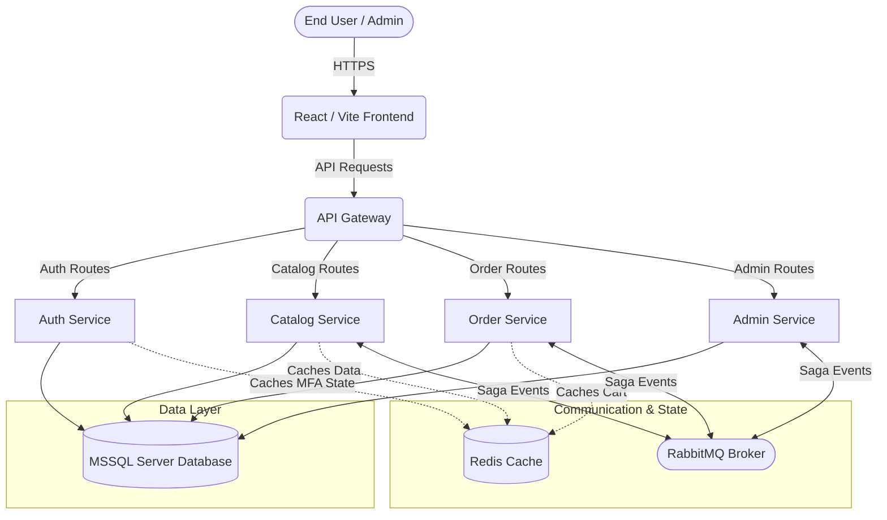
```mermaid
flowchart TD
    User([End User / Admin]) -->|HTTPS| Frontend(React / Vite Frontend)
    Frontend -->|API Requests| Gateway(API Gateway)

    Gateway -->|Auth Routes| AuthService[Auth Service]
    Gateway -->|Catalog Routes| CatalogService[Catalog Service]
    Gateway -->|Order Routes| OrderService[Order Service]
    Gateway -->|Admin Routes| AdminService[Admin Service]

    subgraph Communication & State
        RabbitMQ([RabbitMQ Broker])
        Redis[(Redis Cache)]
    end

    subgraph Data Layer
        DB[(MSSQL Server Database)]
    end

    AuthService --> DB
    CatalogService --> DB
    OrderService --> DB
    AdminService --> DB

    CatalogService -.->|Caches Data| Redis
    OrderService -.->|Caches Cart| Redis
    AuthService -.->|Caches MFA State| Redis

    OrderService <-->|Saga Events| RabbitMQ
    AdminService <-->|Saga Events| RabbitMQ
    CatalogService <-->|Saga Events| RabbitMQ
```

---

## 2. Component Diagram

This diagram shows the structural relationships between the various deployable units and the tech stack components.

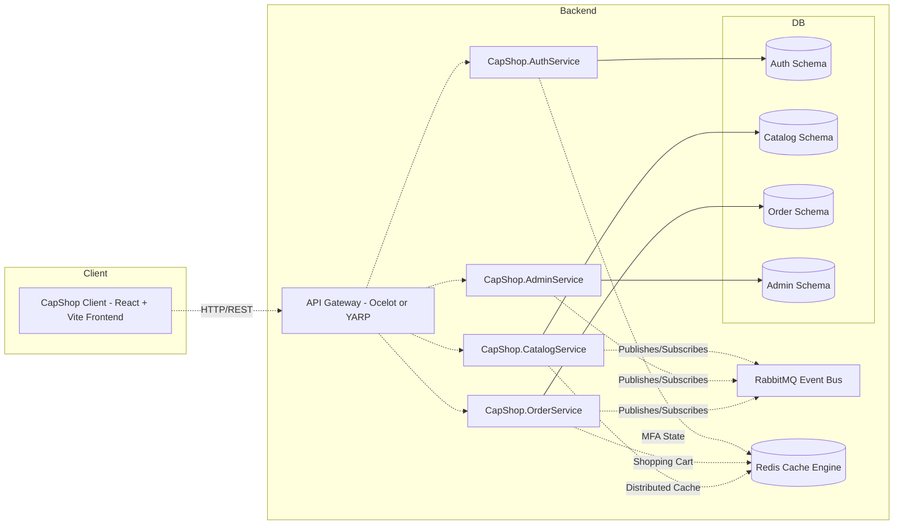
```mermaid
flowchart LR
    subgraph Client
        FE[CapShop Client - React + Vite Frontend]
    end

    subgraph Backend
        GW[API Gateway - Ocelot or YARP]
        AUTH[CapShop.AuthService]
        CAT[CapShop.CatalogService]
        ORD[CapShop.OrderService]
        ADM[CapShop.AdminService]
        MQ[RabbitMQ Event Bus]
        REDIS[(Redis Cache Engine)]

        subgraph DB
            AUTHDB[(Auth Schema)]
            CATDB[(Catalog Schema)]
            ORDDB[(Order Schema)]
            ADMDB[(Admin Schema)]
        end
    end

    FE -. HTTP/REST .-> GW
    GW -.-> AUTH
    GW -.-> CAT
    GW -.-> ORD
    GW -.-> ADM

    AUTH --> AUTHDB
    CAT --> CATDB
    ORD --> ORDDB
    ADM --> ADMDB

    ORD -. Publishes/Subscribes .-> MQ
    ADM -. Publishes/Subscribes .-> MQ
    CAT -. Publishes/Subscribes .-> MQ

    CAT -. Distributed Cache .-> REDIS
    ORD -. Shopping Cart .-> REDIS
    AUTH -. MFA State .-> REDIS
```

---

## 3. Deployment Diagram

Illustrating how the containers are hosted via Docker Compose.

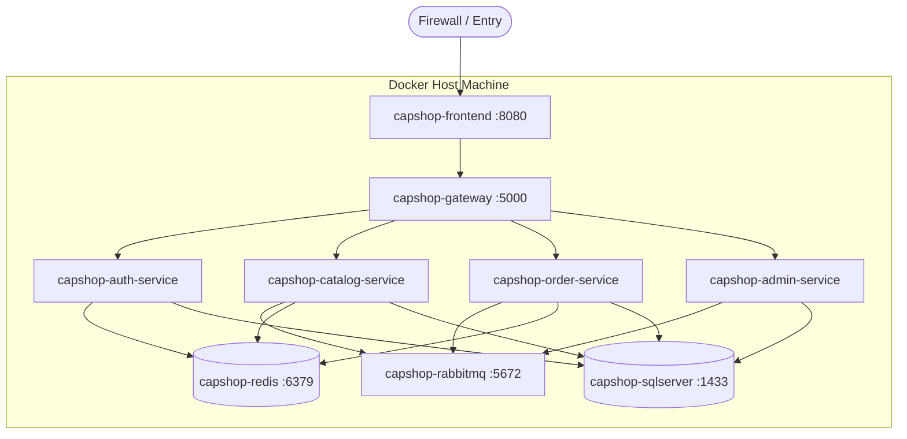
```mermaid
flowchart TD
    FW([Firewall / Entry])

    subgraph DOCKER[Docker Host Machine]
        FE[capshop-frontend :8080]
        GW[capshop-gateway :5000]

        AUTH[capshop-auth-service]
        CAT[capshop-catalog-service]
        ORD[capshop-order-service]
        ADM[capshop-admin-service]

        MQ[capshop-rabbitmq :5672]
        REDIS[(capshop-redis :6379)]
        SQL[(capshop-sqlserver :1433)]
    end

    FW --> FE
    FE --> GW

    GW --> AUTH
    GW --> CAT
    GW --> ORD
    GW --> ADM

    ORD --> MQ
    ADM --> MQ
    CAT --> MQ

    CAT --> REDIS
    ORD --> REDIS
    AUTH --> REDIS

    AUTH --> SQL
    CAT --> SQL
    ORD --> SQL
    ADM --> SQL
```

---

## 4. State Machine Diagram (Order Lifecycle)

This state diagram models the dynamic behavior of the core `Order` entity throughout its payment and fulfillment lifecycle globally orchestrated via RabbitMQ.

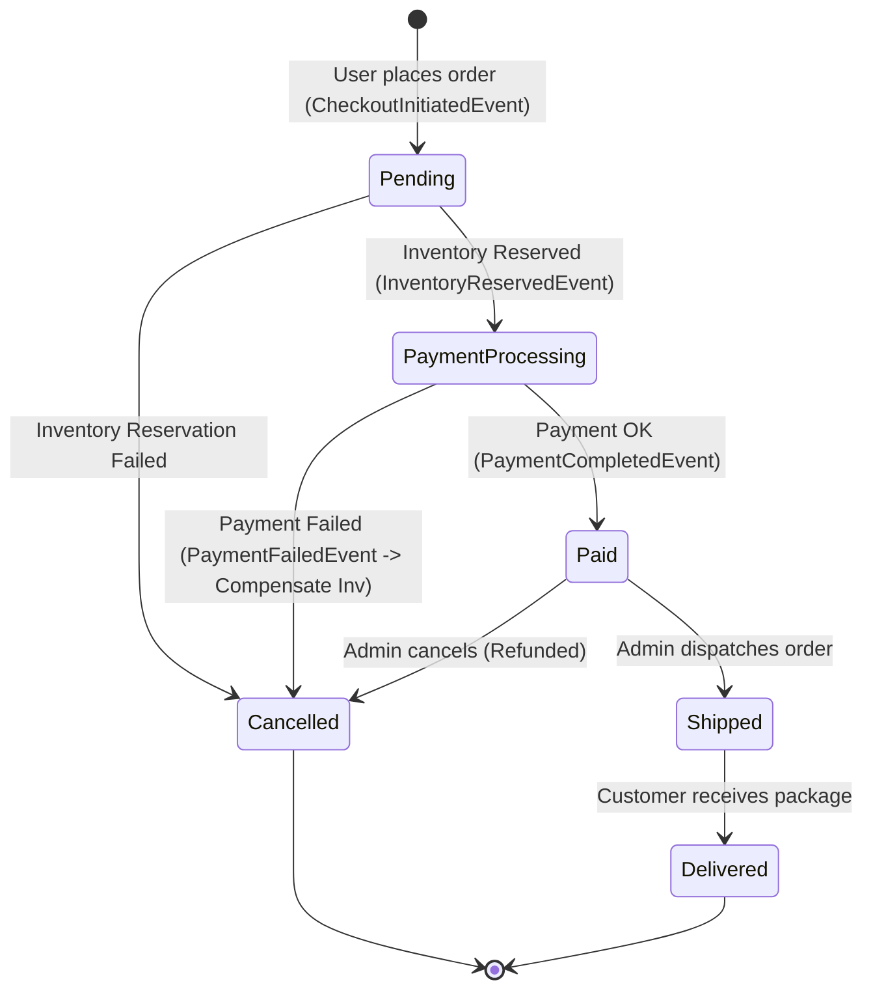
```mermaid
stateDiagram-v2
    [*] --> Pending : User places order (CheckoutInitiatedEvent)

    Pending --> PaymentProcessing : Inventory Reserved (InventoryReservedEvent)
    Pending --> Cancelled : Inventory Reservation Failed

    PaymentProcessing --> Paid : Payment OK (PaymentCompletedEvent)
    PaymentProcessing --> Cancelled : Payment Failed (PaymentFailedEvent -> Compensate Inv)

    Paid --> Shipped : Admin dispatches order
    Paid --> Cancelled : Admin cancels (Refunded)

    Shipped --> Delivered : Customer receives package

    Cancelled --> [*]
    Delivered --> [*]
```

---

## 5. Activity Diagram (Saga Checkout Flow)

This diagram maps out the saga orchestration logic required to distribute a checkout transaction across microservices.

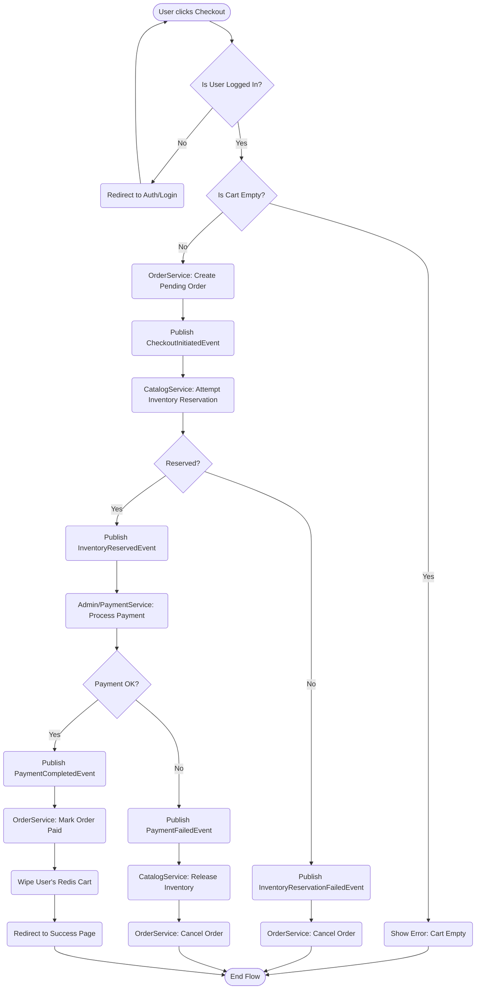
```mermaid
flowchart TD
    Start([User clicks Checkout]) --> ValUser{Is User Logged In?}

    ValUser -->|No| PromptLogin(Redirect to Auth/Login)
    PromptLogin --> Start

    ValUser -->|Yes| ValCart{Is Cart Empty?}

    ValCart -->|Yes| ErrCart(Show Error: Cart Empty)
    ErrCart --> End([End Flow])

    ValCart -->|No| CreateOrder(OrderService: Create Pending Order)
    CreateOrder --> PubCheckout(Publish CheckoutInitiatedEvent)

    PubCheckout --> ReserveInv(CatalogService: Attempt Inventory Reservation)
    ReserveInv --> CheckInv{Reserved?}
    CheckInv -->|No| PubInvFail(Publish InventoryReservationFailedEvent)
    PubInvFail --> CompensateOrder(OrderService: Cancel Order)
    CompensateOrder --> End

    CheckInv -->|Yes| PubInvSuccess(Publish InventoryReservedEvent)
    PubInvSuccess --> ProcessPayment(Admin/PaymentService: Process Payment)
    ProcessPayment --> CheckPay{Payment OK?}

    CheckPay -->|No| PubPayFail(Publish PaymentFailedEvent)
    PubPayFail --> CompensateInv(CatalogService: Release Inventory)
    CompensateInv --> CompensateOrder2(OrderService: Cancel Order)
    CompensateOrder2 --> End

    CheckPay -->|Yes| PubPaySuccess(Publish PaymentCompletedEvent)
    PubPaySuccess --> ConfirmOrder(OrderService: Mark Order Paid)
    ConfirmOrder --> ClearCart(Wipe User's Redis Cart)
    ClearCart --> Success(Redirect to Success Page)
    Success --> End
```

---

## 6. Use Case Diagram

The following diagram captures the interactions between the primary actors (Customer, Admin) and the CapShop system.

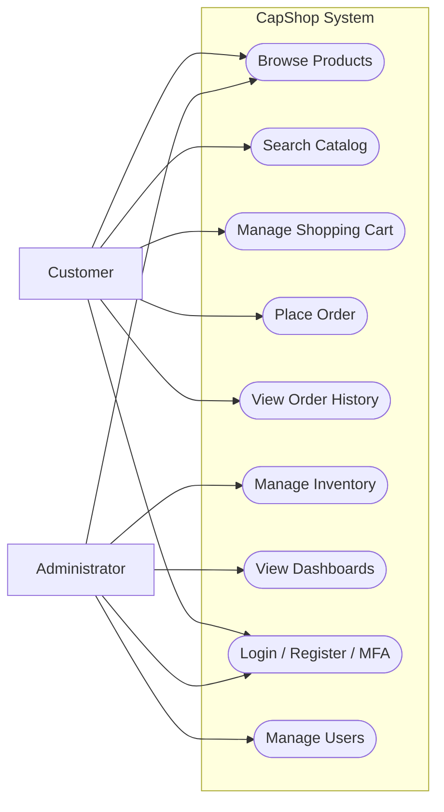
```mermaid
flowchart LR
    Customer[Customer]
    Admin[Administrator]

    subgraph CapShop[CapShop System]
        UC1([Browse Products])
        UC2([Search Catalog])
        UC3([Manage Shopping Cart])
        UC4([Place Order])
        UC5([View Order History])
        UC6([Manage Inventory])
        UC7([View Dashboards])
        UC8([Login / Register / MFA])
        UC9([Manage Users])
    end

    Customer --> UC1
    Customer --> UC2
    Customer --> UC3
    Customer --> UC4
    Customer --> UC5
    Customer --> UC8

    Admin --> UC6
    Admin --> UC7
    Admin --> UC8
    Admin --> UC9
    Admin --> UC1
```

---

## 7. Entity-Relationship (ER) Diagram

The internal databases follow standard Relational constructs holding the E-Commerce domain. Note that Cart storage is natively persisted in Redis, so it is decoupled from the SQL ER representation below.

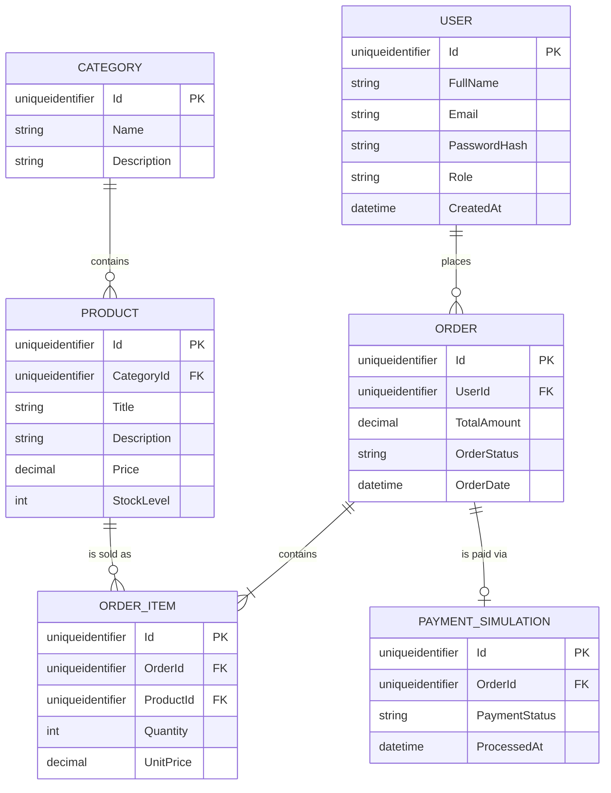
```mermaid
erDiagram
    USER {
        uniqueidentifier Id PK
        string FullName
        string Email
        string PasswordHash
        string Role
        datetime CreatedAt
    }

    CATEGORY {
        uniqueidentifier Id PK
        string Name
        string Description
    }

    PRODUCT {
        uniqueidentifier Id PK
        uniqueidentifier CategoryId FK
        string Title
        string Description
        decimal Price
        int StockLevel
    }

    ORDER {
        uniqueidentifier Id PK
        uniqueidentifier UserId FK
        decimal TotalAmount
        string OrderStatus
        datetime OrderDate
    }

    ORDER_ITEM {
        uniqueidentifier Id PK
        uniqueidentifier OrderId FK
        uniqueidentifier ProductId FK
        int Quantity
        decimal UnitPrice
    }

    PAYMENT_SIMULATION {
        uniqueidentifier Id PK
        uniqueidentifier OrderId FK
        string PaymentStatus
        datetime ProcessedAt
    }

    USER ||--o{ ORDER : "places"
    CATEGORY ||--o{ PRODUCT : "contains"
    ORDER ||--|{ ORDER_ITEM : "contains"
    PRODUCT ||--o{ ORDER_ITEM : "is sold as"
    ORDER ||--o| PAYMENT_SIMULATION : "is paid via"
```

---

## 8. Data Flow Diagram (DFD)

### Level 0 (Context Diagram)

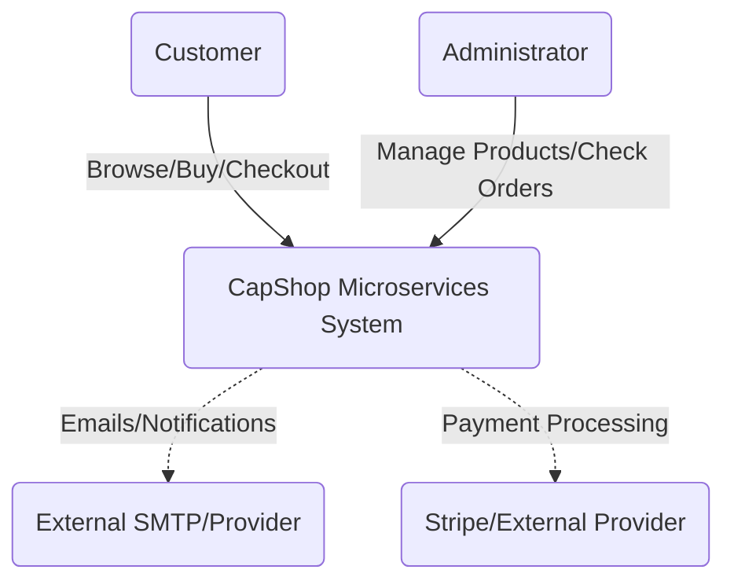
```mermaid
flowchart TD
    Customer(Customer) -->|Browse/Buy/Checkout| System(CapShop Microservices System)
    Admin(Administrator) -->|Manage Products/Check Orders| System
    System -.->|Emails/Notifications| EmailProvider(External SMTP/Provider)
    System -.->|Payment Processing| PaymentGateway(Stripe/External Provider)
```

### Level 1 DFD

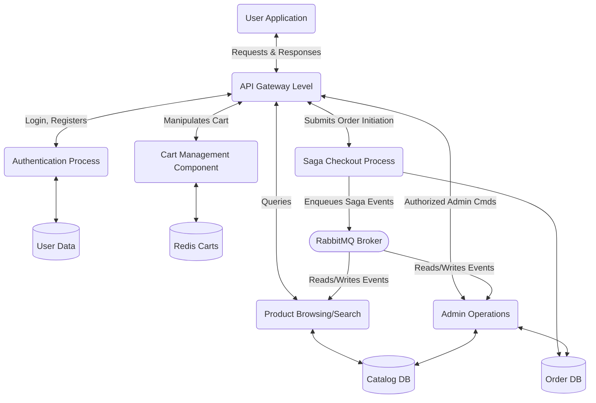
```mermaid
flowchart TD
    User(User Application)

    System_Gateway(API Gateway Level)

    P1(Authentication Process)
    P2(Product Browsing/Search)
    P3(Cart Management Component)
    P4(Saga Checkout Process)
    P5(Admin Operations)

    DB_User[(User Data)]
    DB_Cat[(Catalog DB)]
    DB_Orders[(Order DB)]
    Redis_Carts[(Redis Carts)]
    Broker([RabbitMQ Broker])

    User <-->|Requests & Responses| System_Gateway

    System_Gateway <-->|Login, Registers| P1
    System_Gateway <-->|Queries| P2
    System_Gateway <-->|Manipulates Cart| P3
    System_Gateway <-->|Submits Order Initiation| P4
    System_Gateway <-->|Authorized Admin Cmds| P5

    P1 <--> DB_User
    P2 <--> DB_Cat
    P3 <--> Redis_Carts
    P4 --> DB_Orders
    P4 -->|Enqueues Saga Events| Broker

    Broker -->|Reads/Writes Events| P5
    Broker -->|Reads/Writes Events| P2
    P5 <--> DB_Cat
    P5 <--> DB_Orders
```

---

## 9. Class Diagram (Domain Model Example)

This class diagram focuses on the domain relationships used in the Order Service backing the transaction.

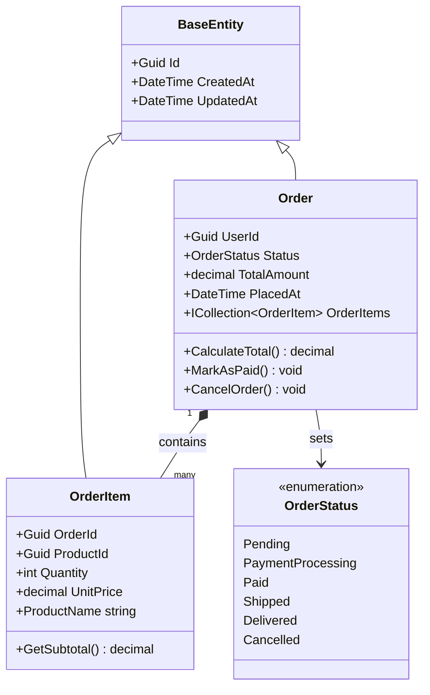
```mermaid
classDiagram
    class BaseEntity {
        +Guid Id
        +DateTime CreatedAt
        +DateTime UpdatedAt
    }

    class Order {
        +Guid UserId
        +OrderStatus Status
        +decimal TotalAmount
        +DateTime PlacedAt
        +ICollection~OrderItem~ OrderItems
        +CalculateTotal() decimal
        +MarkAsPaid() void
        +CancelOrder() void
    }

    class OrderItem {
        +Guid OrderId
        +Guid ProductId
        +int Quantity
        +decimal UnitPrice
        +ProductName string
        +GetSubtotal() decimal
    }

    class OrderStatus {
        <<enumeration>>
        Pending
        PaymentProcessing
        Paid
        Shipped
        Delivered
        Cancelled
    }

    BaseEntity <|-- Order
    BaseEntity <|-- OrderItem

    Order "1" *-- "many" OrderItem : contains
    Order --> OrderStatus : sets
```

---

## 10. Sequence Diagrams

### 10.1 Authentication & MFA Loop

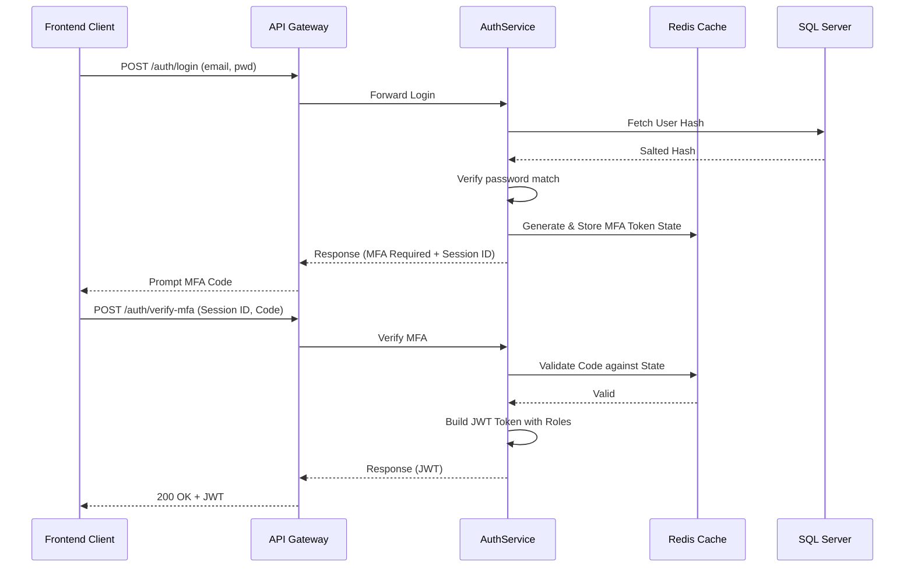
```mermaid
sequenceDiagram
    participant UI as Frontend Client
    participant GW as API Gateway
    participant Auth as AuthService
    participant Redis as Redis Cache
    participant DB as SQL Server

    UI->>GW: POST /auth/login (email, pwd)
    GW->>Auth: Forward Login
    Auth->>DB: Fetch User Hash
    DB-->>Auth: Salted Hash
    Auth->>Auth: Verify password match
    Auth->>Redis: Generate & Store MFA Token State
    Auth-->>GW: Response (MFA Required + Session ID)
    GW-->>UI: Prompt MFA Code

    UI->>GW: POST /auth/verify-mfa (Session ID, Code)
    GW->>Auth: Verify MFA
    Auth->>Redis: Validate Code against State
    Redis-->>Auth: Valid
    Auth->>Auth: Build JWT Token with Roles
    Auth-->>GW: Response (JWT)
    GW-->>UI: 200 OK + JWT
```

### 10.2 Saga Order Placement Flow (Event Driven)

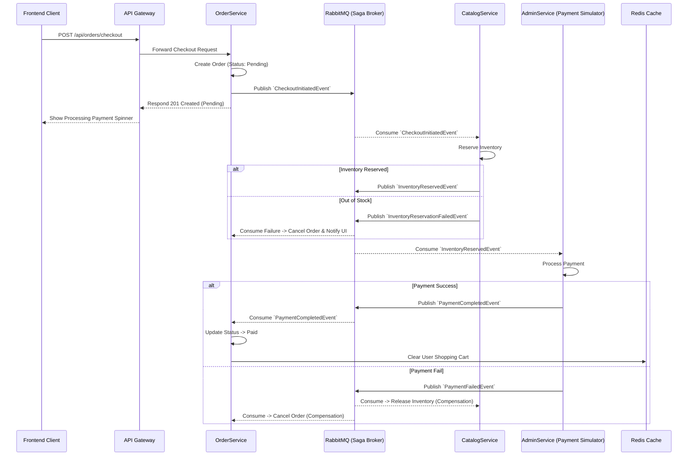
```mermaid
sequenceDiagram
    participant UI as Frontend Client
    participant GW as API Gateway
    participant Order as OrderService
    participant MQ as RabbitMQ (Saga Broker)
    participant Catalog as CatalogService
    participant Admin as AdminService (Payment Simulator)
    participant Redis as Redis Cache

    UI->>GW: POST /api/orders/checkout
    GW->>Order: Forward Checkout Request
    Order->>Order: Create Order (Status: Pending)
    Order->>MQ: Publish `CheckoutInitiatedEvent`
    Order-->>GW: Respond 201 Created (Pending)
    GW-->>UI: Show Processing Payment Spinner

    %% Saga Flow Step 1: Inventory
    MQ-->>Catalog: Consume `CheckoutInitiatedEvent`
    Catalog->>Catalog: Reserve Inventory
    alt Inventory Reserved
        Catalog->>MQ: Publish `InventoryReservedEvent`
    else Out of Stock
        Catalog->>MQ: Publish `InventoryReservationFailedEvent`
        MQ-->>Order: Consume Failure -> Cancel Order & Notify UI
    end

    %% Saga Flow Step 2: Payment
    MQ-->>Admin: Consume `InventoryReservedEvent`
    Admin->>Admin: Process Payment
    alt Payment Success
        Admin->>MQ: Publish `PaymentCompletedEvent`
        MQ-->>Order: Consume `PaymentCompletedEvent`
        Order->>Order: Update Status -> Paid
        Order->>Redis: Clear User Shopping Cart
    else Payment Fail
        Admin->>MQ: Publish `PaymentFailedEvent`
        MQ-->>Catalog: Consume -> Release Inventory (Compensation)
        MQ-->>Order: Consume -> Cancel Order (Compensation)
    end
```

---

## 11. Detailed Service Diagrams

### 11.1 AuthService Detail

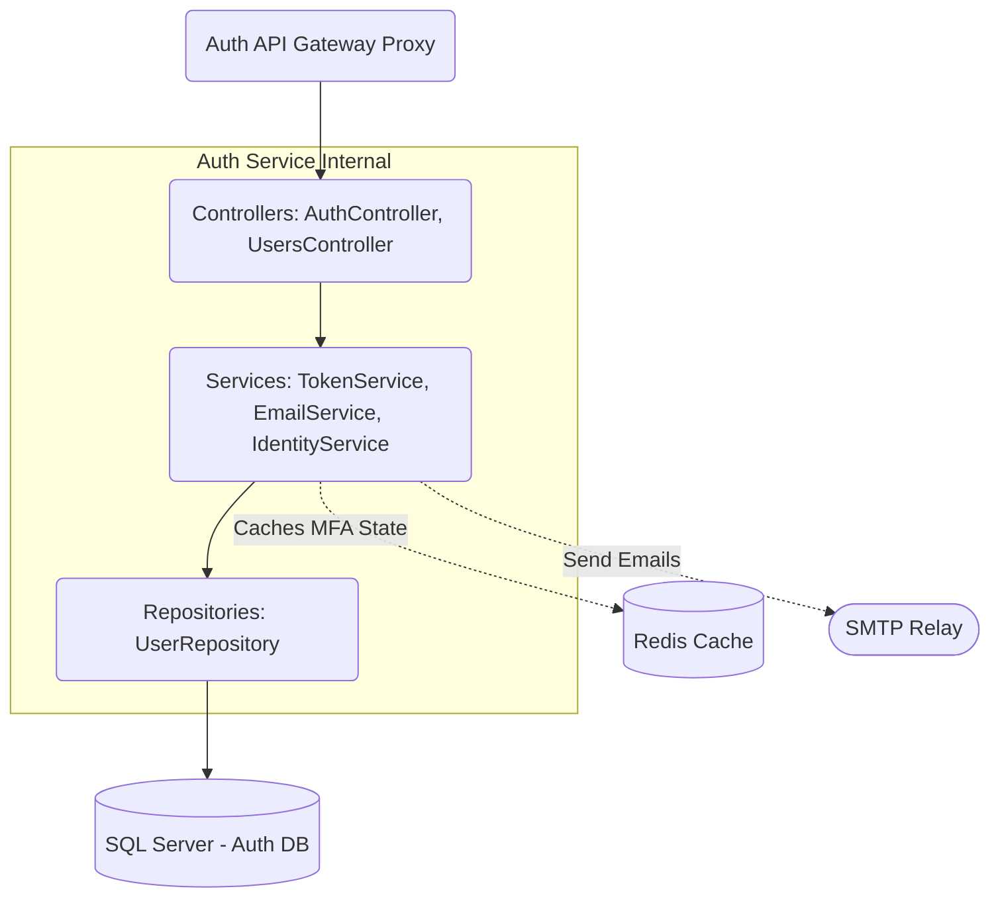
```mermaid
flowchart TD
    API(Auth API Gateway Proxy)

    subgraph AuthService[Auth Service Internal]
        C(Controllers: AuthController, UsersController)
        S(Services: TokenService, EmailService, IdentityService)
        R(Repositories: UserRepository)
        C --> S
        S --> R
    end

    API --> C
    R --> DB[(SQL Server - Auth DB)]
    S -.->|Caches MFA State| Redis[(Redis Cache)]
    S -.->|Send Emails| SMTP([SMTP Relay])
```

### 11.2 CatalogService Detail

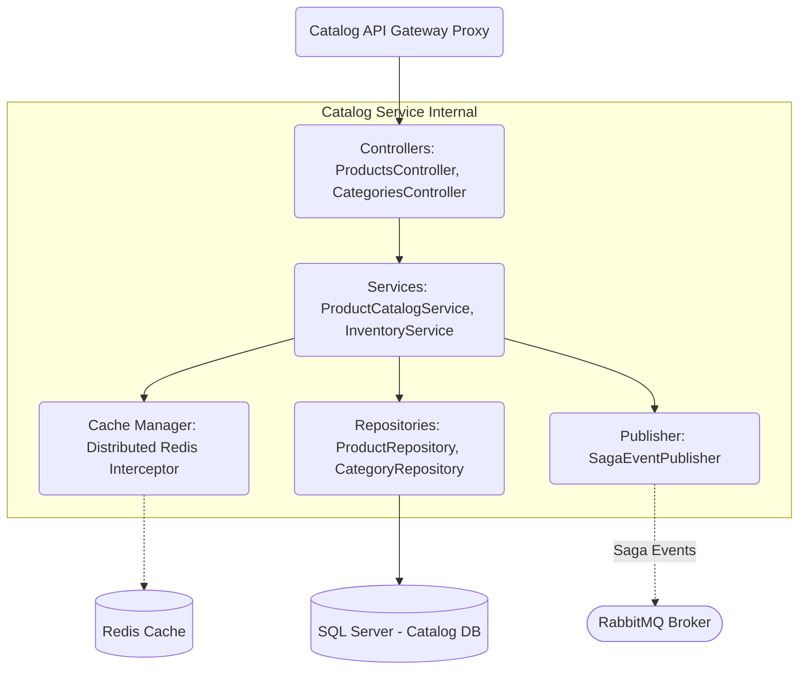
```mermaid
flowchart TD
    API(Catalog API Gateway Proxy)

    subgraph CatalogService[Catalog Service Internal]
        C(Controllers: ProductsController, CategoriesController)
        S(Services: ProductCatalogService, InventoryService)
        R(Repositories: ProductRepository, CategoryRepository)
        Cache(Cache Manager: Distributed Redis Interceptor)
        P(Publisher: SagaEventPublisher)

        C --> S
        S --> Cache
        S --> R
        S --> P
    end

    API --> C
    R --> DB[(SQL Server - Catalog DB)]
    Cache -.-> Redis[(Redis Cache)]
    P -.->|Saga Events| MQ([RabbitMQ Broker])
```

### 11.3 OrderService Detail

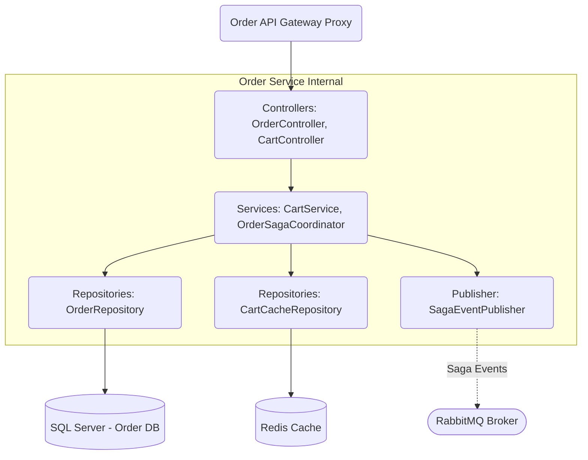
```mermaid
flowchart TD
    API(Order API Gateway Proxy)

    subgraph OrderService[Order Service Internal]
        C(Controllers: OrderController, CartController)
        S(Services: CartService, OrderSagaCoordinator)
        R(Repositories: OrderRepository)
        CR(Repositories: CartCacheRepository)
        P(Publisher: SagaEventPublisher)

        C --> S
        S --> R
        S --> CR
        S --> P
    end

    API --> C
    R --> DB[(SQL Server - Order DB)]
    CR --> Redis[(Redis Cache)]
    P -.->|Saga Events| MQ([RabbitMQ Broker])
```

### 11.4 AdminService Detail

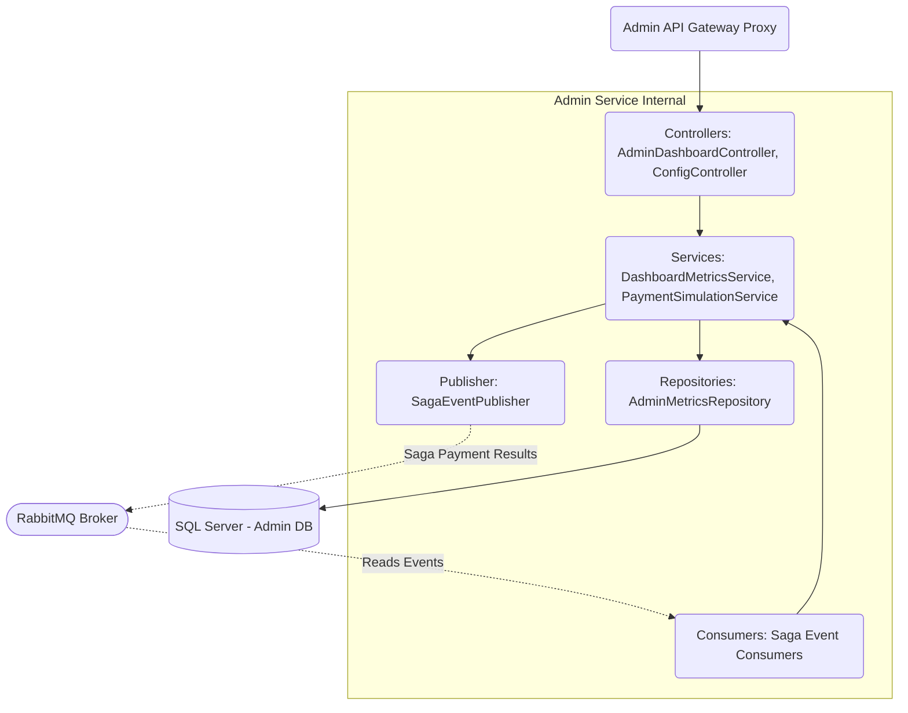
```mermaid
flowchart TD
    API(Admin API Gateway Proxy)

    subgraph AdminService[Admin Service Internal]
        C(Controllers: AdminDashboardController, ConfigController)
        Cons(Consumers: Saga Event Consumers)
        S(Services: DashboardMetricsService, PaymentSimulationService)
        R(Repositories: AdminMetricsRepository)
        P(Publisher: SagaEventPublisher)

        C --> S
        Cons --> S
        S --> R
        S --> P
    end

    API --> C
    R --> DB[(SQL Server - Admin DB)]
    MQ([RabbitMQ Broker]) -.->|Reads Events| Cons
    P -.->|Saga Payment Results| MQ
```
