# CapShop System Architecture Documentation

This document outlines the detailed system architecture, diagrams, and low-level designs for CapShop, a distributed e-commerce application based on microservices.

## 1. High-Level Design (HLD)
The system is built on a microservices architecture to ensure high scalability, independent deployments, and separation of concerns.

- **Frontend**: A React application (built with Vite) that communicates with the backend via the API Gateway.
- **Gateway**: A centralized entry point (acting as an API Gateway / Reverse Proxy) routing frontend HTTP requests to respective microservices.
- **Microservices**:
  - **AuthService**: Handles user authentication, authorization, registration, and JWT token issuance.
  - **CatalogService**: Manages the product catalog, categories, inventory, and search.
  - **OrderService**: Handles shopping cart management, order placement, and payment simulation.
  - **AdminService**: Admin portal logic, dashboards, and background processes watching across domains.
- **Message Broker**: **RabbitMQ** is used for asynchronous/event-driven communication (e.g., `OrderPlacedIntegrationEvent`).
- **Caching**: **Redis** is natively used for fast ephemeral storage (like user sessions or temporary carts/MFA tokens).
- **Database**: **MSSQL Server** serves as the persistent database for the microservices.

### HLD Context Diagram (Mermaid)
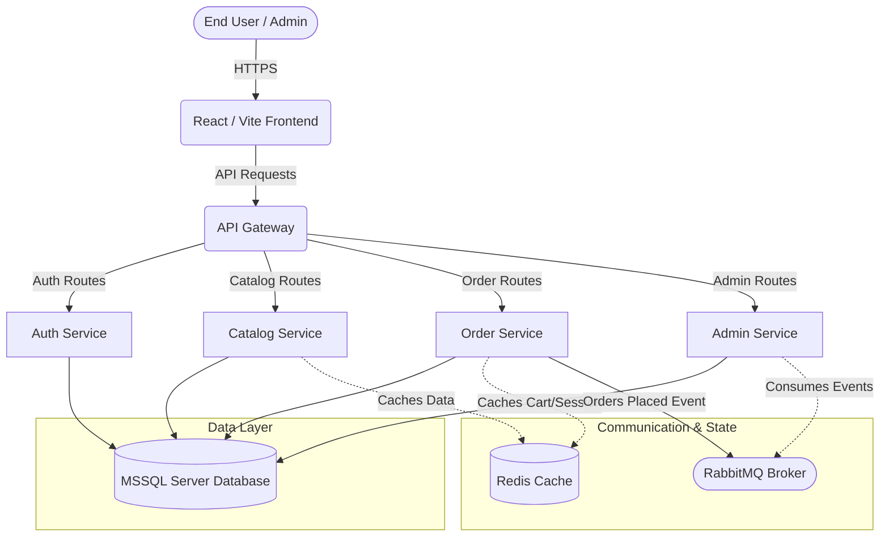

---

## 2. Component Diagram
This diagram shows the structural relationships between the various deployable units and the tech stack components.

```mermaid
componentDiagram
    package "CapShop Client" {
        [React + Vite Frontend]
    }
    
    package "CapShop Backend (Docker Network)" {
        [API Gateway (Ocelot/YARP)]
        
        node "Auth Component" {
            [CapShop.AuthService]
        }
        
        node "Catalog Component" {
            [CapShop.CatalogService]
        }
        
        node "Order Component" {
            [CapShop.OrderService]
        }
        
        node "Admin Component" {
            [CapShop.AdminService]
        }
        
        node "Infrastructure Components" {
            [RabbitMQ Event Bus]
            [Redis Cache Engine]
        }
        
        database "MSSQL Server" {
            [Auth Schema]
            [Catalog Schema]
            [Order Schema]
            [Admin Schema]
        }
    }
    
    [React + Vite Frontend] ..> [API Gateway (Ocelot/YARP)] : HTTP/REST
    [API Gateway (Ocelot/YARP)] ..> [CapShop.AuthService]
    [API Gateway (Ocelot/YARP)] ..> [CapShop.CatalogService]
    [API Gateway (Ocelot/YARP)] ..> [CapShop.OrderService]
    [API Gateway (Ocelot/YARP)] ..> [CapShop.AdminService]
    
    [CapShop.AuthService] --> [Auth Schema]
    [CapShop.CatalogService] --> [Catalog Schema]
    [CapShop.OrderService] --> [Order Schema]
    [CapShop.AdminService] --> [Admin Schema]
    
    [CapShop.OrderService] ..> [RabbitMQ Event Bus] : Publishes
    [CapShop.AdminService] ..> [RabbitMQ Event Bus] : Subscribes
    
    [CapShop.CatalogService] ..> [Redis Cache Engine]
    [CapShop.OrderService] ..> [Redis Cache Engine]
```

---

## 3. Deployment Diagram
Illustrating how the containers are hosted via Docker Compose.


---

## 4. State Machine Diagram (Order Lifecycle)
This state diagram models the dynamic behavior of the core `Order` entity throughout its payment and fulfillment lifecycle.

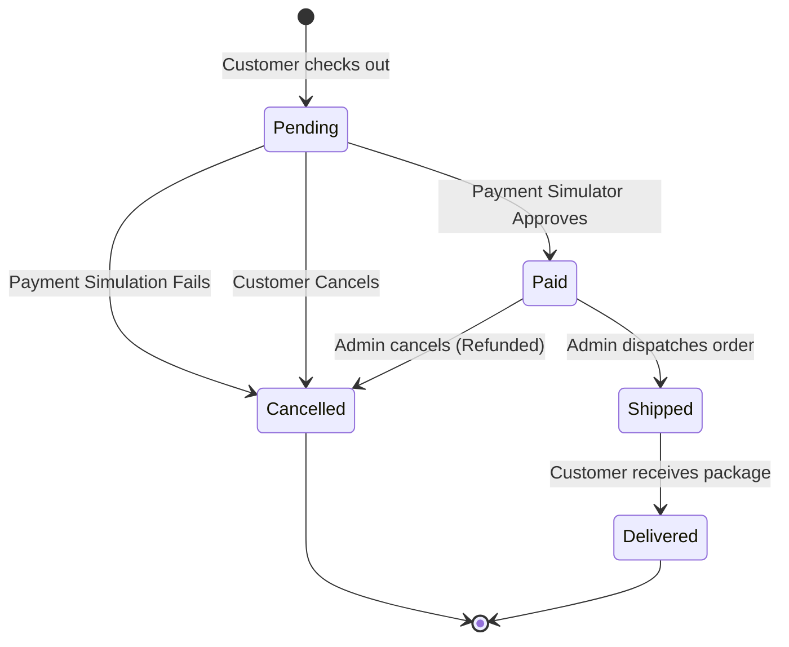

---

## 5. Activity Diagram (Checkout Flow)
This diagram maps out the branching logic required to determine whether an order can be successfully placed.

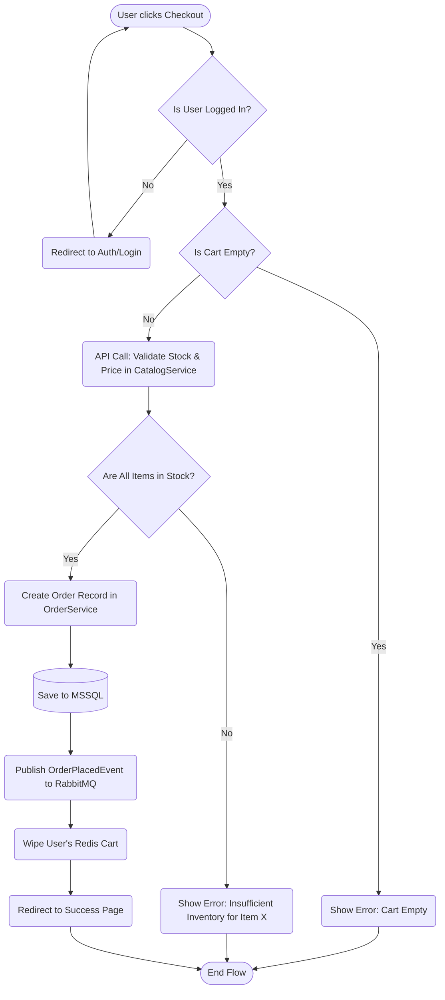

---

## 6. Use Case Diagram
The following diagram captures the interactions between the primary actors (Customer, Admin) and the CapShop system.

```mermaid
usecaseDiagram
    actor Customer as "Customer"
    actor Admin as "Administrator"
    
    package CapShop System {
        usecase "Browse Products" as UC1
        usecase "Search Catalog" as UC2
        usecase "Manage Shopping Cart" as UC3
        usecase "Place Order" as UC4
        usecase "View Order History" as UC5
        usecase "Manage Inventory" as UC6
        usecase "View Dashboards" as UC7
        usecase "Login / Register" as UC8
        usecase "Manage Users" as UC9
    }
    
    Customer --> UC1
    Customer --> UC2
    Customer --> UC3
    Customer --> UC4
    Customer --> UC5
    Customer --> UC8
    
    Admin --> UC6
    Admin --> UC7
    Admin --> UC8
    Admin --> UC9
    Admin --> UC1
```

---

## 7. Entity-Relationship (ER) Diagram
The internal databases follow standard Relational constructs holding the E-Commerce domain.

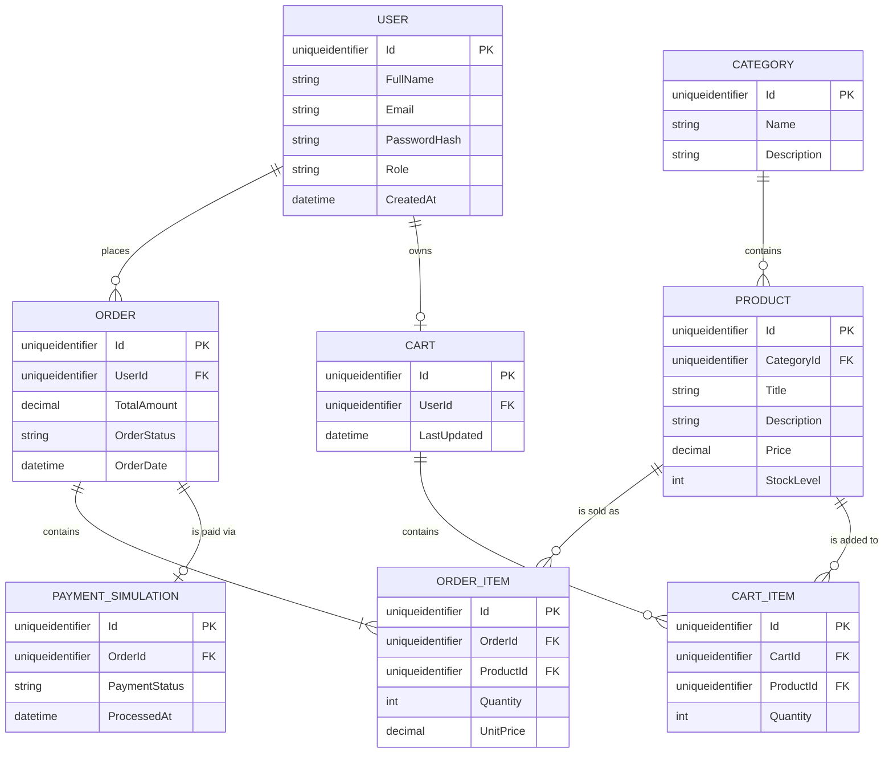

---

## 8. Data Flow Diagram (DFD)

### Level 0 (Context Diagram)
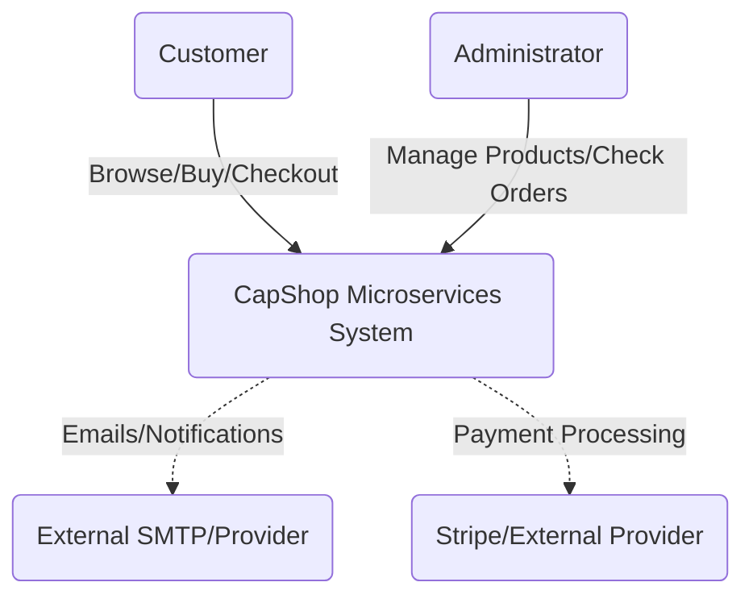

### Level 1 DFD
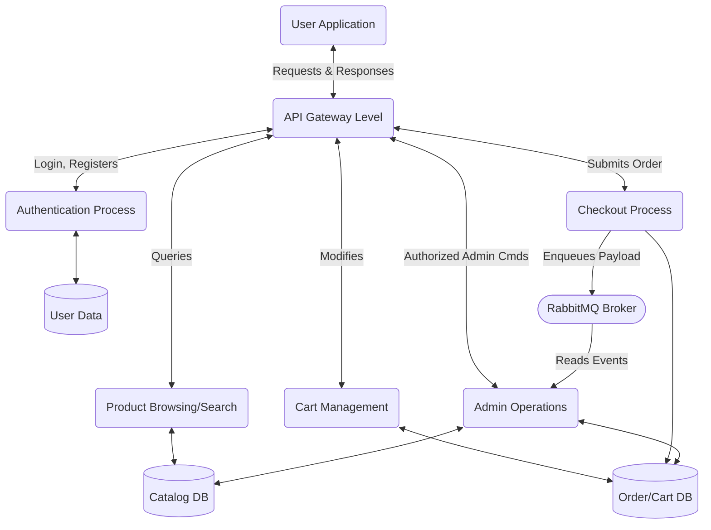

---

## 9. Class Diagram (Domain Model Example)
This class diagram focuses on the domain relationships used in the Order Service backing the transaction.

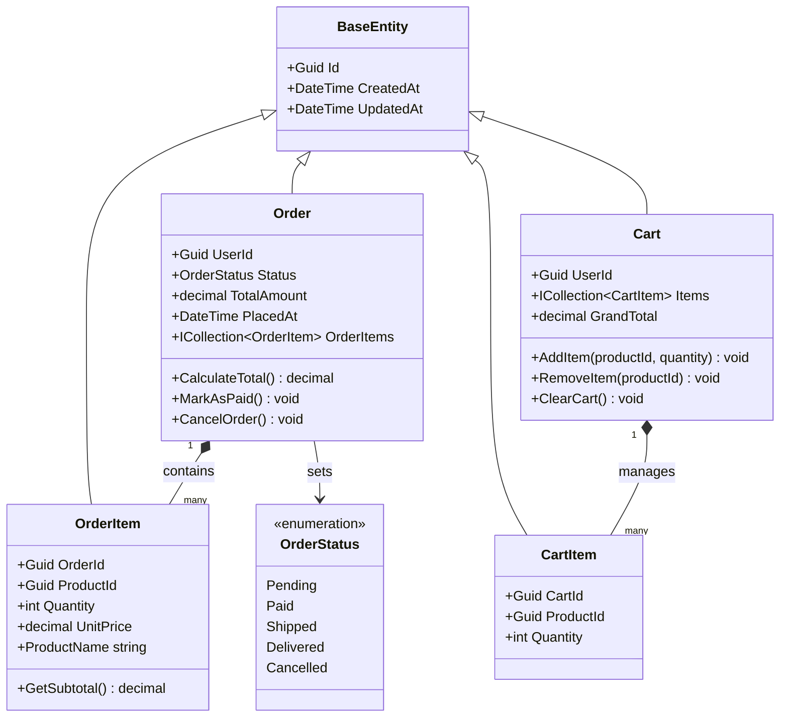

---

## 10. Sequence Diagrams

### 10.1 Authentication Loop
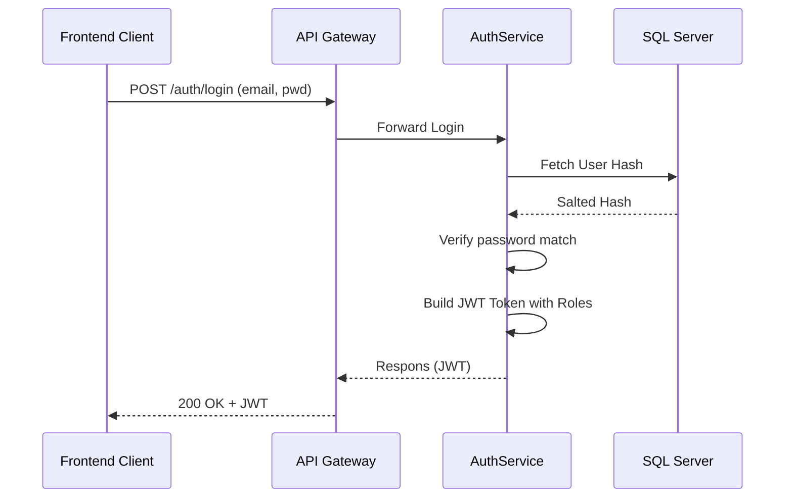

### 10.2 Order Placement Flow (Event Driven)
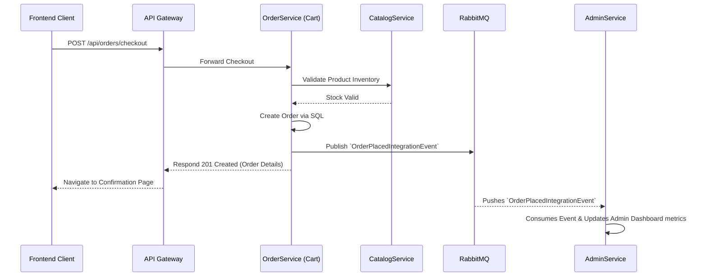

---

## 11. Detailed Service Diagrams

### 11.1 AuthService Detail
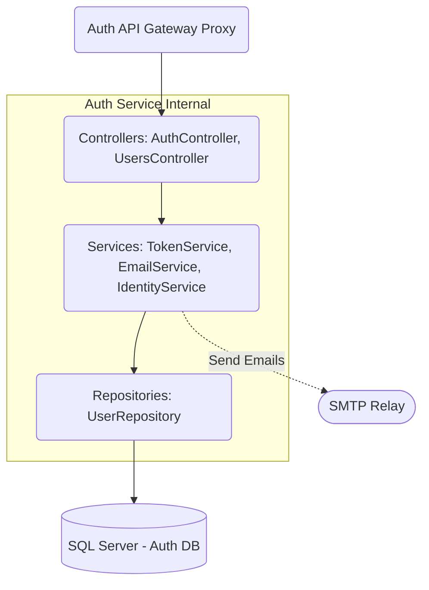

### 11.2 CatalogService Detail
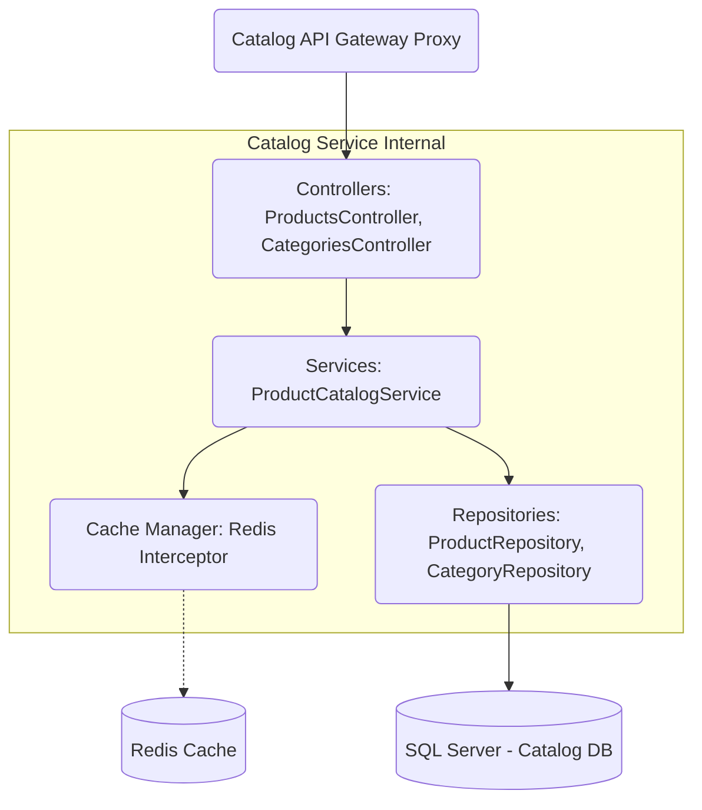

### 11.3 OrderService Detail
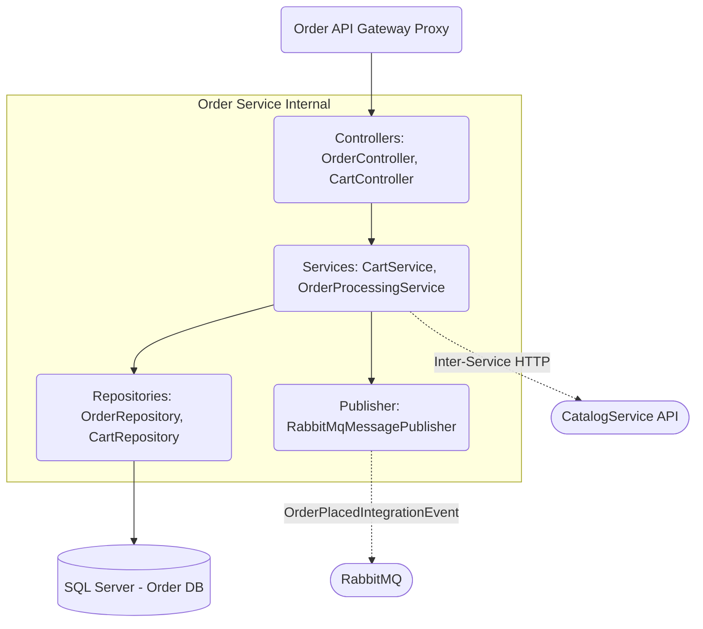

### 11.4 AdminService Detail
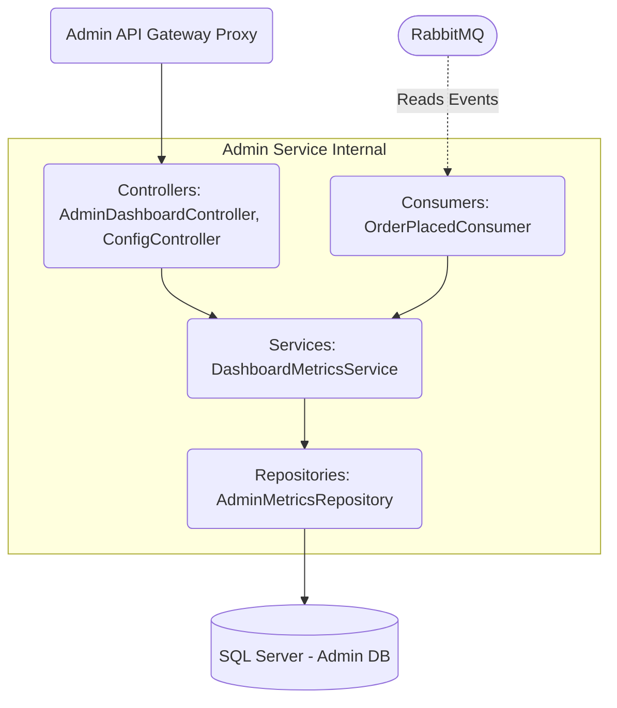
